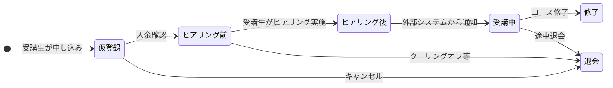

# 受講生管理システム - ユースケース

## 1. 業務フロー概要

### 自動化される処理

- 受講生の申し込み登録（受講生が自分で行う）
- 入金確認後のメール自動送付（ヒアリング案内URL含む）
- ヒアリング実施（受講生がシステム上で自分で行う）
- 受講開始状態への更新（外部システムからAPI通知）

### スタッフの手動業務

- 銀行振込の入金確認
- 退会処理
- コース変更・追加
- コースマスタ管理

---

## 2. アクター

| アクター | 説明 |
|----------|------|
| 受講生（未登録） | 申し込み・ヒアリングを行う |
| 管理者 | システム全体の管理権限を持つ |
| スタッフ | 日常業務（入金確認、退会処理等）を行う |
| 講師 | 受講生情報の閲覧を行う |
| 外部システム | チャットシステム（Discord/Slack）、決済システム等からのAPI連携 |

---

## 3. ユースケース一覧

### 3.1 受講生向け

| UC-ID | ユースケース名 | 概要 |
|-------|----------------|------|
| UC-001 | 申し込みフォームから申し込む | 受講生がコースを選択して申し込みを行う |
| UC-002 | ヒアリングフォームに回答する | 入金確認後、受講生がヒアリングに回答する |

### 3.2 スタッフ向け

| UC-ID | ユースケース名 | 概要 |
|-------|----------------|------|
| UC-101 | 入金を確認して状態を更新する | 銀行振込の入金を確認し、受講生の状態を更新する |
| UC-102 | 退会処理を行う | 受講生の退会処理を行う（ステータス変更） |
| UC-103 | 受講生のコースを変更・追加する | 受講生の要望に応じてコースを変更または追加する |
| UC-104 | コース情報を管理する | コースマスタの登録・編集・削除を行う |
| UC-105 | 受講生情報を検索・閲覧する | 受講生の情報を検索し、詳細を確認する |
| UC-106 | 決済情報を管理する | 決済情報の登録・編集・状態変更を行う |

### 3.3 講師向け

| UC-ID | ユースケース名 | 概要 |
|-------|----------------|------|
| UC-201 | 担当受講生の情報を閲覧する | 担当している受講生の情報を閲覧する |
| UC-202 | ヒアリング情報を確認する | 受講生のヒアリング回答内容を確認する |

### 3.4 外部システム連携

| UC-ID | ユースケース名 | 概要 |
|-------|----------------|------|
| UC-301 | 受講開始を通知する | 外部システムから受講開始の通知を受け、状態を更新する |
| UC-302 | チャットユーザー名を同期する | チャットシステムのユーザー名を登録する |
| UC-303 | チャットユーザー名の変更を通知する | チャットシステムでの名前変更を受けて更新する |

### 3.5 システム自動処理

| UC-ID | ユースケース名 | 概要 |
|-------|----------------|------|
| UC-401 | 入金確認後にメールを自動送付する | 入金確認後、ヒアリング案内メールを自動送付する |
| UC-402 | カード決済完了時に状態を自動更新する | 決済システムからの通知で状態を自動更新する |

---

## 4. ユースケース詳細

### UC-001: 申し込みフォームから申し込む

| 項目 | 内容 |
|------|------|
| アクター | 受講生（未登録） |
| 事前条件 | なし |
| 事後条件 | 受講生が「仮登録」状態で登録される |

**基本フロー**

1. 受講生が申し込みフォームにアクセスする
2. システムがコース一覧を表示する
3. 受講生がコースを選択する
4. 受講生が必要情報（氏名、メールアドレス、電話番号等）を入力する
5. 受講生が申込経路を選択する
6. 受講生が申し込みを確定する
7. システムが受講生を「仮登録」状態で登録する
8. システムが決済情報（未払い状態）を作成する
9. システムが申し込み完了画面を表示する

---

### UC-002: ヒアリングフォームに回答する

| 項目 | 内容 |
|------|------|
| アクター | 受講生（未登録） |
| 事前条件 | 受講生が「ヒアリング前」状態である |
| 事後条件 | 受講生が「ヒアリング後」状態になる |

**基本フロー**

1. 受講生がメールに記載されたヒアリングURLにアクセスする
2. システムがヒアリングフォームを表示する
3. 受講生がヒアリング項目に回答する
4. 受講生が回答を送信する
5. システムがヒアリング回答を保存する
6. システムが受講生の状態を「ヒアリング後」に更新する
7. システムがヒアリング完了画面を表示する

---

### UC-101: 入金を確認して状態を更新する

| 項目 | 内容 |
|------|------|
| アクター | スタッフ |
| 事前条件 | 受講生が「仮登録」状態である、銀行振込で入金がある |
| 事後条件 | 受講生が「ヒアリング前」状態になる、決済が「入金済み」になる |

**基本フロー**

1. スタッフが未払い一覧画面を表示する
2. スタッフが銀行振込の入金を確認する（システム外）
3. スタッフが対象の受講生を選択する
4. スタッフが入金確認を行う
5. システムが決済状態を「入金済み」に更新する
6. システムが受講生の状態を「ヒアリング前」に更新する
7. システムがヒアリング案内メールを自動送付する（UC-401）

---

### UC-102: 退会処理を行う

| 項目 | 内容 |
|------|------|
| アクター | スタッフ |
| 事前条件 | 受講生が登録されている |
| 事後条件 | 受講生が「退会」状態になる |

**基本フロー**

1. スタッフが受講生詳細画面を表示する
2. スタッフが退会処理を選択する
3. システムが確認ダイアログを表示する
4. スタッフが退会を確定する
5. システムが受講生の状態を「退会」に更新する
6. システムが受講履歴の状態を「退会」に更新する

**補足**
- 受講生のデータは削除せず、状態を「退会」に変更する
- クーリングオフ等の理由による退会に対応

---

### UC-103: 受講生のコースを変更・追加する

| 項目 | 内容 |
|------|------|
| アクター | スタッフ |
| 事前条件 | 受講生が登録されている |
| 事後条件 | 受講生のコースが変更または追加される |

**基本フロー（コース変更）**

1. スタッフが受講生詳細画面を表示する
2. スタッフが受講履歴を確認する
3. スタッフがコース変更を選択する
4. システムがコース一覧を表示する
5. スタッフが新しいコースを選択する
6. スタッフが変更を確定する
7. システムが受講履歴を更新する

**基本フロー（コース追加）**

1. スタッフが受講生詳細画面を表示する
2. スタッフがコース追加を選択する
3. システムがコース一覧を表示する
4. スタッフが追加するコースを選択する
5. スタッフが追加を確定する
6. システムが新しい受講履歴を作成する
7. システムが新しい決済情報を作成する

---

### UC-201: 担当受講生の情報を閲覧する

| 項目 | 内容 |
|------|------|
| アクター | 講師 |
| 事前条件 | 講師がログインしている |
| 事後条件 | なし（閲覧のみ） |

**基本フロー**

1. 講師が受講生一覧画面を表示する
2. システムが担当コースの受講生のみを表示する
3. 講師が受講生を選択する
4. システムが受講生詳細を表示する（個人情報は非表示）
5. 講師がヒアリング情報を確認する

**補足**
- 講師はメールアドレス等の個人情報を閲覧できない
- 担当コースの受講生のみ閲覧可能

---

### UC-301: 受講開始を通知する

| 項目 | 内容 |
|------|------|
| アクター | 外部システム |
| 事前条件 | 受講生が「ヒアリング後」状態である |
| 事後条件 | 受講生が「受講中」状態になる |

**基本フロー**

1. 外部システム（Discord/Slack等）が受講開始通知APIを呼び出す
2. システムがAPIリクエストを認証する
3. システムが対象の受講生を特定する
4. システムが受講生の状態を「受講中」に更新する
5. システムが受講履歴の受講開始日を設定する
6. システムが成功レスポンスを返す

---

### UC-302: チャットユーザー名を同期する

| 項目 | 内容 |
|------|------|
| アクター | 外部システム |
| 事前条件 | 受講生が登録されている |
| 事後条件 | 受講生のチャットユーザー名が登録される |

**基本フロー**

1. 外部システムがチャットユーザー名登録APIを呼び出す
2. システムがAPIリクエストを認証する
3. システムが対象の受講生を特定する
4. システムがチャットユーザー名を保存する
5. システムが成功レスポンスを返す

---

### UC-401: 入金確認後にメールを自動送付する

| 項目 | 内容 |
|------|------|
| アクター | システム（自動） |
| 事前条件 | 受講生の入金が確認された |
| 事後条件 | ヒアリング案内メールが送付される |

**基本フロー**

1. システムが入金確認イベントを検知する
2. システムがヒアリング案内メールのテンプレートを取得する
3. システムが受講生情報をテンプレートに埋め込む
4. システムがヒアリングURLを生成する
5. システムがメールを送付する
6. システムがメール送付履歴を記録する

---

### UC-402: カード決済完了時に状態を自動更新する

| 項目 | 内容 |
|------|------|
| アクター | 外部システム（決済システム） |
| 事前条件 | 受講生が「仮登録」状態である |
| 事後条件 | 受講生が「ヒアリング前」状態になる、決済が「入金済み」になる |

**基本フロー**

1. 決済システムがWebhookで決済完了を通知する
2. システムがWebhookリクエストを認証する
3. システムが対象の受講生・決済情報を特定する
4. システムが決済状態を「入金済み」に更新する
5. システムが受講生の状態を「ヒアリング前」に更新する
6. システムがヒアリング案内メールを自動送付する（UC-401）
7. システムが成功レスポンスを返す

---

## 5. ユースケース図

```mermaid
graph TB
    subgraph actors [アクター]
        Student[受講生]
        Staff[スタッフ]
        Instructor[講師]
        ExternalSystem[外部システム]
    end

    subgraph student_uc [受講生向け]
        UC001[UC-001: 申し込み]
        UC002[UC-002: ヒアリング回答]
    end

    subgraph staff_uc [スタッフ向け]
        UC101[UC-101: 入金確認]
        UC102[UC-102: 退会処理]
        UC103[UC-103: コース変更・追加]
        UC104[UC-104: コース管理]
        UC105[UC-105: 受講生検索・閲覧]
        UC106[UC-106: 決済管理]
    end

    subgraph instructor_uc [講師向け]
        UC201[UC-201: 受講生閲覧]
        UC202[UC-202: ヒアリング確認]
    end

    subgraph external_uc [外部連携]
        UC301[UC-301: 受講開始通知]
        UC302[UC-302: チャット名同期]
        UC303[UC-303: チャット名変更]
    end

    subgraph auto_uc [自動処理]
        UC401[UC-401: メール自動送付]
        UC402[UC-402: 決済完了処理]
    end

    Student --> UC001
    Student --> UC002
    Staff --> UC101
    Staff --> UC102
    Staff --> UC103
    Staff --> UC104
    Staff --> UC105
    Staff --> UC106
    Instructor --> UC201
    Instructor --> UC202
    ExternalSystem --> UC301
    ExternalSystem --> UC302
    ExternalSystem --> UC303
    ExternalSystem --> UC402
    UC101 -.-> UC401
    UC402 -.-> UC401
```

