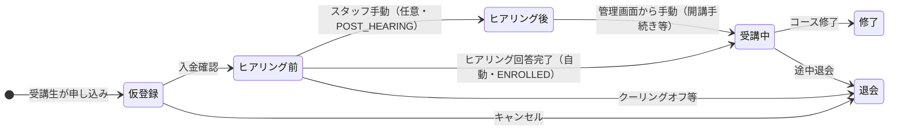
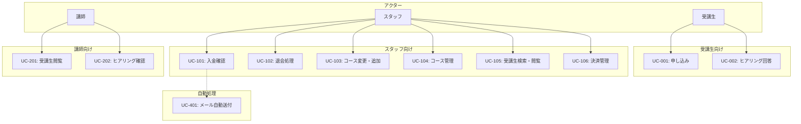

# 受講生管理システム - ユースケース

## 1. 業務フロー概要

```mermaid
stateDiagram-v2
    direction LR
    [*] --> 仮登録: 受講生が申し込み
    仮登録 --> ヒアリング前: 入金確認
    ヒアリング前 --> ヒアリング後: スタッフ手動（任意・POST_HEARING）
    ヒアリング後 --> 受講中: 管理画面から手動（開講手続き等）
    ヒアリング前 --> 受講中: ヒアリング回答完了（自動・ENROLLED）
    受講中 --> 修了: コース修了
    受講中 --> 退会: 途中退会
    仮登録 --> 退会: キャンセル
    ヒアリング前 --> 退会: クーリングオフ等
```

> **注:** ヒアリングフォーム送信では `PRE_HEARING` から回答保存と同時に `ENROLLED`（受講中）へ遷移します。`POST_HEARING`（ヒアリング後）は管理画面からの手動遷移で利用する任意の経路です。

### 自動化される処理

- 受講生の申し込み登録（受講生が自分で行う）
- ヒアリング実施（受講生がシステム上で自分で行う）
- ヒアリング完了に伴う受講中状態への更新（システム内で自動）
- （任意）入金確認後のメール自動送付・ヒアリング案内URL送付

### スタッフの手動業務

- 銀行振込の入金確認
- 退会処理
- コース変更・追加
- コースマスタ管理

---

## 2. アクター

| アクター | 説明 |
|----------|------|
| 受講生（未登録） | 申し込み・ヒアリングを行う |
| 管理者 | システム全体の管理権限を持つ |
| スタッフ | 日常業務（入金確認、退会処理等）を行う |
| 講師 | 受講生情報の閲覧を行う |

---

## 3. ユースケース一覧

### 3.1 受講生向け

| UC-ID | ユースケース名 | 概要 |
|-------|----------------|------|
| UC-001 | 申し込みフォームから申し込む | 受講生がコースを選択して申し込みを行う |
| UC-002 | ヒアリングフォームに回答する | 入金確認後、受講生がヒアリングに回答する |

### 3.2 スタッフ向け

| UC-ID | ユースケース名 | 概要 |
|-------|----------------|------|
| UC-101 | 入金を確認して状態を更新する | 銀行振込の入金を確認し、受講生の状態を更新する |
| UC-102 | 退会処理を行う | 受講生の退会処理を行う（ステータス変更） |
| UC-103 | 受講生のコースを変更・追加する | 受講生の要望に応じてコースを変更または追加する |
| UC-104 | コース情報を管理する | コースマスタの登録・編集・削除を行う |
| UC-105 | 受講生情報を検索・閲覧する | 受講生の情報を検索し、詳細を確認する |
| UC-106 | 決済情報を管理する | 決済情報の登録・編集・状態変更を行う |

### 3.3 講師向け

| UC-ID | ユースケース名 | 概要 |
|-------|----------------|------|
| UC-201 | 担当受講生の情報を閲覧する | 担当している受講生の情報を閲覧する |
| UC-202 | ヒアリング情報を確認する | 受講生のヒアリング回答内容を確認する |

### 3.4 システム自動処理

| UC-ID | ユースケース名 | 概要 |
|-------|----------------|------|
| UC-401 | 入金確認後にメールを自動送付する | 入金確認後、ヒアリング案内メールを自動送付する（未実装の場合はスコープ外） |

※外部システム連携（決済Webhook・チャット連携等）は現行スコープ外とする（旧 UC-301〜303、UC-402 は廃止）。

---

## 4. ユースケース詳細

### UC-001: 申し込みフォームから申し込む

| 項目 | 内容 |
|------|------|
| アクター | 受講生（未登録） |
| 事前条件 | なし |
| 事後条件 | 受講生が「仮登録」状態で登録される |

**基本フロー**

1. 受講生が申し込みフォームにアクセスする
2. システムがコース一覧を表示する
3. 受講生がコースを選択する
4. 受講生が必要情報（氏名、メールアドレス、電話番号等）を入力する
5. 受講生が申込経路を選択する
6. 受講生が申し込みを確定する
7. システムが受講生を「仮登録」状態で登録する
8. システムが決済情報（未払い状態）を作成する
9. システムが申し込み完了画面を表示する

---

### UC-002: ヒアリングフォームに回答する

| 項目 | 内容 |
|------|------|
| アクター | 受講生（未登録） |
| 事前条件 | 受講生が「ヒアリング前」状態である |
| 事後条件 | 受講生が「受講中」状態になる（ステータス `ENROLLED`。ヒアリング回答の保存と同時に遷移） |

**基本フロー**

1. 受講生が共有されたヒアリングURL（トークン付き）にアクセスする
2. システムがヒアリングフォームを表示する
3. 受講生がヒアリング項目に回答する
4. 受講生が回答を送信する
5. システムがヒアリング回答を保存する
6. システムが受講生の状態を「受講中」に更新する
7. システムがヒアリング完了画面を表示する

---

### UC-101: 入金を確認して状態を更新する

| 項目 | 内容 |
|------|------|
| アクター | スタッフ |
| 事前条件 | 受講生が「仮登録」状態である、銀行振込で入金がある |
| 事後条件 | 受講生が「ヒアリング前」状態になる、決済が「入金済み」になる |

**基本フロー**

1. スタッフが未払い一覧画面を表示する
2. スタッフが銀行振込の入金を確認する（システム外）
3. スタッフが対象の受講生を選択する
4. スタッフが入金確認を行う
5. システムが決済状態を「入金済み」に更新する
6. システムが受講生の状態を「ヒアリング前」に更新する
7. （任意）システムがヒアリング案内メールを自動送付する（UC-401）

---

### UC-102: 退会処理を行う

| 項目 | 内容 |
|------|------|
| アクター | スタッフ |
| 事前条件 | 受講生が登録されている |
| 事後条件 | 受講生が「退会」状態になる |

**基本フロー**

1. スタッフが受講生詳細画面を表示する
2. スタッフが退会処理を選択する
3. システムが確認ダイアログを表示する
4. スタッフが退会を確定する
5. システムが受講生の状態を「退会」に更新する
6. システムが受講履歴の状態を「退会」に更新する

**補足**
- 受講生のデータは削除せず、状態を「退会」に変更する
- クーリングオフ等の理由による退会に対応

---

### UC-103: 受講生のコースを変更・追加する

| 項目 | 内容 |
|------|------|
| アクター | スタッフ |
| 事前条件 | 受講生が登録されている |
| 事後条件 | 受講生のコースが変更または追加される |

**基本フロー（コース変更）**

1. スタッフが受講生詳細画面を表示する
2. スタッフが受講履歴を確認する
3. スタッフがコース変更を選択する
4. システムがコース一覧を表示する
5. スタッフが新しいコースを選択する
6. スタッフが変更を確定する
7. システムが受講履歴を更新する

**基本フロー（コース追加）**

1. スタッフが受講生詳細画面を表示する
2. スタッフがコース追加を選択する
3. システムがコース一覧を表示する
4. スタッフが追加するコースを選択する
5. スタッフが追加を確定する
6. システムが新しい受講履歴を作成する
7. システムが新しい決済情報を作成する

---

### UC-201: 担当受講生の情報を閲覧する

| 項目 | 内容 |
|------|------|
| アクター | 講師 |
| 事前条件 | 講師がログインしている |
| 事後条件 | なし（閲覧のみ） |

**基本フロー**

1. 講師が受講生一覧画面を表示する
2. システムが担当コースの受講生のみを表示する
3. 講師が受講生を選択する
4. システムが受講生詳細を表示する（個人情報は非表示）
5. 講師がヒアリング情報を確認する

**補足**
- 講師はメールアドレス等の個人情報を閲覧できない
- 担当コースの受講生のみ閲覧可能

---

### UC-401: 入金確認後にメールを自動送付する

| 項目 | 内容 |
|------|------|
| アクター | システム（自動） |
| 事前条件 | 受講生の入金が確認された |
| 事後条件 | ヒアリング案内メールが送付される |

**基本フロー**

1. システムが入金確認イベントを検知する
2. システムがヒアリング案内メールのテンプレートを取得する
3. システムが受講生情報をテンプレートに埋め込む
4. システムがヒアリングURLを生成する
5. システムがメールを送付する
6. システムがメール送付履歴を記録する

---

## 5. ユースケース図

```mermaid
graph TB
    subgraph actors [アクター]
        Student[受講生]
        Staff[スタッフ]
        Instructor[講師]
    end

    subgraph student_uc [受講生向け]
        UC001[UC-001: 申し込み]
        UC002[UC-002: ヒアリング回答]
    end

    subgraph staff_uc [スタッフ向け]
        UC101[UC-101: 入金確認]
        UC102[UC-102: 退会処理]
        UC103[UC-103: コース変更・追加]
        UC104[UC-104: コース管理]
        UC105[UC-105: 受講生検索・閲覧]
        UC106[UC-106: 決済管理]
    end

    subgraph instructor_uc [講師向け]
        UC201[UC-201: 受講生閲覧]
        UC202[UC-202: ヒアリング確認]
    end

    subgraph auto_uc [自動処理]
        UC401[UC-401: メール自動送付]
    end

    Student --> UC001
    Student --> UC002
    Staff --> UC101
    Staff --> UC102
    Staff --> UC103
    Staff --> UC104
    Staff --> UC105
    Staff --> UC106
    Instructor --> UC201
    Instructor --> UC202
    UC101 -.-> UC401
```
