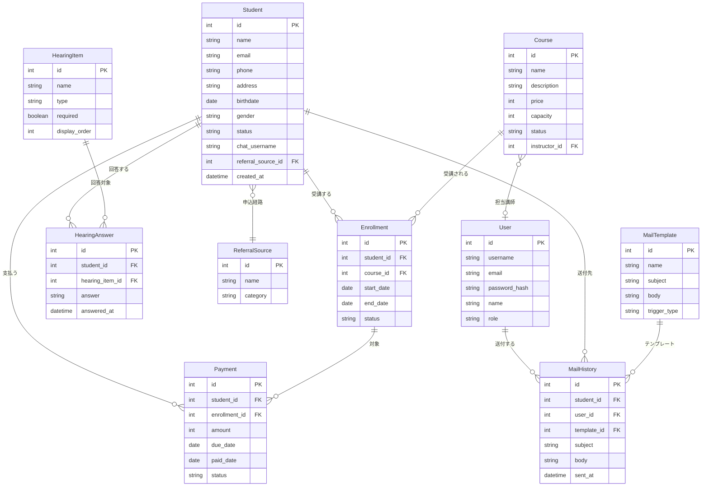

# 受講生管理システム - 概念データモデル

## 1. エンティティ一覧

| エンティティ | 説明 | 主要属性 |
|--------------|------|----------|
| 受講生 | コースを受講する人 | 氏名、メールアドレス、電話番号、住所、生年月日、性別、状態 |
| コース | 受講生が受講する講座 | コース名、説明、料金、定員、状態 |
| 受講履歴 | 受講生とコースの紐付け | 受講開始日、受講終了日、受講状況 |
| 決済 | 受講料の決済情報 | 金額、決済期日、決済日、決済状態 |
| ヒアリング回答 | 受講生のヒアリング回答 | 回答内容、回答日時 |
| ヒアリング項目 | ヒアリングの質問項目（マスタ） | 項目名、項目種別、必須フラグ |
| 申込経路 | 申し込みの流入元（マスタ） | 経路名、カテゴリ |
| ユーザー | システム利用者 | ユーザー名、メールアドレス、氏名、ロール |
| メールテンプレート | メール送付用テンプレート | テンプレート名、件名、本文 |
| メール送付履歴 | 送付したメールの履歴 | 送付日時、送付先、件名 |

---

## 2. ER図（概念レベル）

---

## 3. エンティティ詳細

### 3.1 受講生（Student）

| 属性 | 型 | 必須 | 説明 |
|------|-----|:----:|------|
| id | int | ✅ | 主キー |
| name | string | ✅ | 氏名 |
| email | string | ✅ | メールアドレス |
| phone | string | - | 電話番号 |
| address | string | - | 住所 |
| birthdate | date | - | 生年月日 |
| gender | string | - | 性別 |
| status | string | ✅ | 状態（仮登録/ヒアリング前/ヒアリング後/受講中/修了/退会） |
| chat_username | string | - | 外部チャットシステムのユーザー名 |
| referral_source_id | int | ✅ | 申込経路（FK） |
| created_at | datetime | ✅ | 登録日時 |

### 3.2 コース（Course）

| 属性 | 型 | 必須 | 説明 |
|------|-----|:----:|------|
| id | int | ✅ | 主キー |
| name | string | ✅ | コース名 |
| description | string | - | コース説明 |
| price | int | ✅ | 料金 |
| capacity | int | - | 定員 |
| status | string | ✅ | 状態（募集中/開講中/満席/終了） |
| instructor_id | int | - | 担当講師（FK） |

### 3.3 受講履歴（Enrollment）

| 属性 | 型 | 必須 | 説明 |
|------|-----|:----:|------|
| id | int | ✅ | 主キー |
| student_id | int | ✅ | 受講生（FK） |
| course_id | int | ✅ | コース（FK） |
| start_date | date | ✅ | 受講開始日 |
| end_date | date | - | 受講終了日 |
| status | string | ✅ | 受講状況（受講中/修了/退会） |

### 3.4 決済（Payment）

| 属性 | 型 | 必須 | 説明 |
|------|-----|:----:|------|
| id | int | ✅ | 主キー |
| student_id | int | ✅ | 受講生（FK） |
| enrollment_id | int | ✅ | 受講履歴（FK） |
| amount | int | ✅ | 決済金額 |
| due_date | date | ✅ | 決済期日 |
| paid_date | date | - | 決済日 |
| status | string | ✅ | 決済状態（未払い/入金済み） |

### 3.5 ヒアリング項目（HearingItem）

| 属性 | 型 | 必須 | 説明 |
|------|-----|:----:|------|
| id | int | ✅ | 主キー |
| name | string | ✅ | 項目名 |
| type | string | ✅ | 項目種別（テキスト/選択/複数選択等） |
| required | boolean | ✅ | 必須フラグ |
| display_order | int | ✅ | 表示順 |

### 3.6 ヒアリング回答（HearingAnswer）

| 属性 | 型 | 必須 | 説明 |
|------|-----|:----:|------|
| id | int | ✅ | 主キー |
| student_id | int | ✅ | 受講生（FK） |
| hearing_item_id | int | ✅ | ヒアリング項目（FK） |
| answer | string | ✅ | 回答内容 |
| answered_at | datetime | ✅ | 回答日時 |

### 3.7 申込経路（ReferralSource）

| 属性 | 型 | 必須 | 説明 |
|------|-----|:----:|------|
| id | int | ✅ | 主キー |
| name | string | ✅ | 経路名 |
| category | string | ✅ | カテゴリ（Web/広告/SNS/紹介/その他） |

### 3.8 ユーザー（User）

| 属性 | 型 | 必須 | 説明 |
|------|-----|:----:|------|
| id | int | ✅ | 主キー |
| username | string | ✅ | ユーザー名 |
| email | string | ✅ | メールアドレス |
| password_hash | string | ✅ | パスワード（ハッシュ化） |
| name | string | ✅ | 氏名 |
| role | string | ✅ | ロール（管理者/スタッフ/講師） |

### 3.9 メールテンプレート（MailTemplate）

| 属性 | 型 | 必須 | 説明 |
|------|-----|:----:|------|
| id | int | ✅ | 主キー |
| name | string | ✅ | テンプレート名 |
| subject | string | ✅ | 件名 |
| body | string | ✅ | 本文 |
| trigger_type | string | - | 自動送付のトリガー種別 |

### 3.10 メール送付履歴（MailHistory）

| 属性 | 型 | 必須 | 説明 |
|------|-----|:----:|------|
| id | int | ✅ | 主キー |
| student_id | int | ✅ | 送付先受講生（FK） |
| user_id | int | - | 送付者（FK、自動送付の場合はnull） |
| template_id | int | - | 使用テンプレート（FK） |
| subject | string | ✅ | 件名 |
| body | string | ✅ | 本文 |
| sent_at | datetime | ✅ | 送付日時 |

---

## 4. 主要なリレーションシップ

| 関係 | カーディナリティ | 説明 |
|------|------------------|------|
| 受講生 - 受講履歴 | 1:N | 1人の受講生が複数のコースを受講できる |
| コース - 受講履歴 | 1:N | 1つのコースに複数の受講生が登録される |
| 受講生 - 決済 | 1:N | 1人の受講生が複数の決済を持つ |
| 受講履歴 - 決済 | 1:N | 1つの受講履歴に複数の決済がある場合も（分割払い等） |
| 受講生 - ヒアリング回答 | 1:N | 1人の受講生が複数のヒアリング項目に回答 |
| ヒアリング項目 - ヒアリング回答 | 1:N | 1つの項目に複数の受講生が回答 |
| 受講生 - 申込経路 | N:1 | 複数の受講生が同じ経路から申し込む |
| コース - ユーザー（講師） | N:1 | 1人の講師が複数のコースを担当 |
