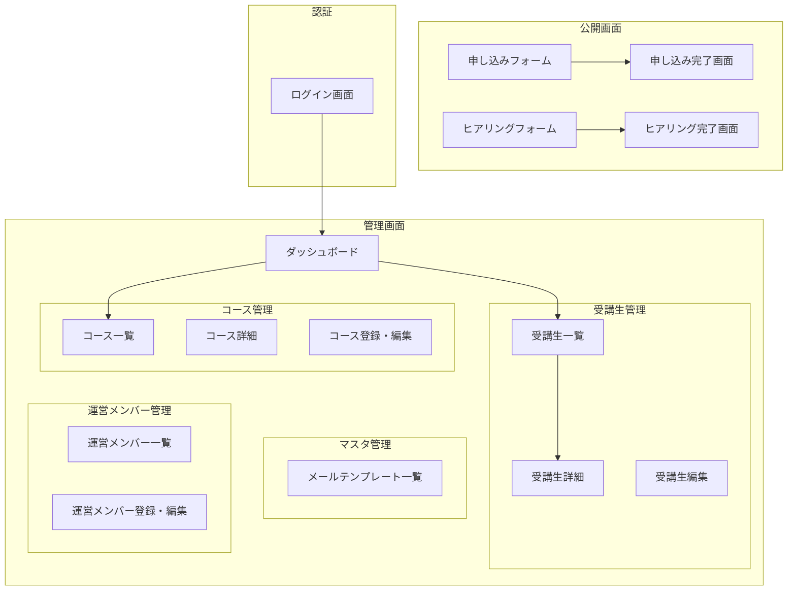
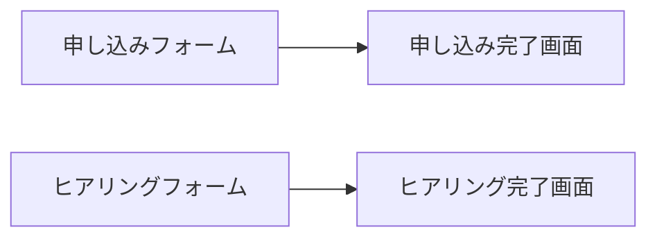
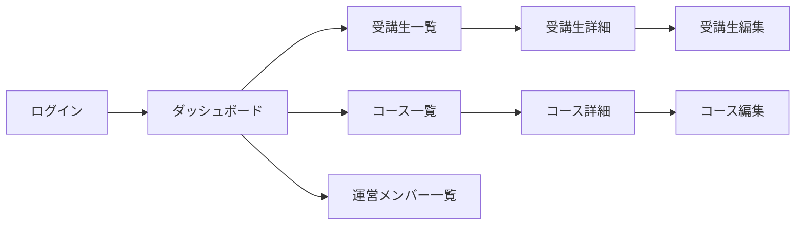
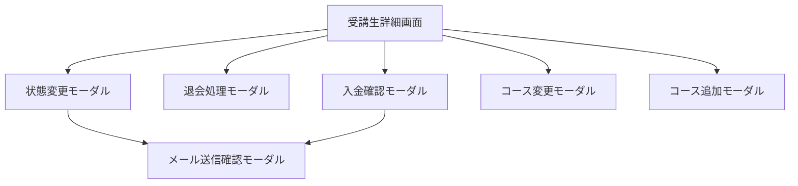

# 受講生管理システム - 画面一覧

## 1. 画面構成概要

---

## 2. 公開画面（認証不要）

### 2.1 受講生向け

| 画面ID | 画面名 | 概要 | 関連機能 |
|--------|--------|------|----------|
| PUB-001 | 申し込みフォーム | コース選択と受講生情報入力 | APP-001, APP-002 |
| PUB-002 | 申し込み完了画面 | 申し込み完了メッセージ表示 | APP-002 |
| PUB-003 | ヒアリングフォーム | ヒアリング項目への回答入力（URLトークンでアクセス） | APP-003, APP-004 |
| PUB-004 | ヒアリング完了画面 | ヒアリング完了メッセージ表示 | APP-004 |

※ 受講生向けのログイン機能は Phase 1 では不要（申し込み・ヒアリングは公開画面で完結）

### 2.2 管理者向け認証

| 画面ID | 画面名 | 概要 | 関連機能 |
|--------|--------|------|----------|
| AUTH-001 | ログイン画面 | 運営メンバー用のユーザー名・パスワード入力 | USR-001 |

---

## 3. 管理画面（認証必要）

### 3.1 共通

| 画面ID | 画面名 | 概要 | 対象ロール |
|--------|--------|------|------------|
| ADM-001 | ダッシュボード | 各機能へのナビゲーション、概要表示 | 全ロール |
| ADM-002 | ヘッダー/サイドバー | ナビゲーション、ログアウト | 全ロール |

### 3.2 受講生管理

| 画面ID | 画面名 | 概要 | 対象ロール |
|--------|--------|------|------------|
| STU-010 | 受講生一覧画面 | 受講生の一覧表示、検索、フィルタ（状態、未払い等） | 管理者、スタッフ、講師 |
| STU-011 | 受講生詳細画面 | 受講生の詳細情報、ヒアリング情報、受講履歴、決済情報を統合表示 | 管理者、スタッフ、講師 |
| STU-012 | 受講生編集画面 | 受講生情報の編集 | 管理者、スタッフ |

**受講生詳細画面に含まれる機能：**
- 基本情報の表示・編集
- 受講履歴の表示・コース変更・追加
- 決済情報の表示・入金確認
- ヒアリング回答の表示
- 状態変更（モーダル）
- 退会処理（モーダル）
- メール送信（モーダル）※状態変更時に確認

### 3.3 コース管理

| 画面ID | 画面名 | 概要 | 対象ロール |
|--------|--------|------|------------|
| CRS-010 | コース一覧画面 | コースの一覧表示 | 管理者、スタッフ、講師 |
| CRS-011 | コース詳細画面 | コースの詳細情報、受講生一覧表示 | 管理者、スタッフ、講師 |
| CRS-012 | コース登録・編集画面 | コース情報の登録・編集 | 管理者、スタッフ |

### 3.4 マスタ管理

| 画面ID | 画面名 | 概要 | 対象ロール |
|--------|--------|------|------------|
| MST-010 | メールテンプレート一覧画面 | メールテンプレートの一覧 | 管理者 |
| MST-011 | メールテンプレート編集画面 | メールテンプレートの登録・編集 | 管理者 |

※ 申込経路マスタ管理は不要（外部サービス連携を考慮し、コードで管理）
※ ヒアリング項目マスタ管理は不要（デザインへの影響を考慮し、実装で直接管理）

### 3.5 運営メンバー管理

| 画面ID | 画面名 | 概要 | 対象ロール |
|--------|--------|------|------------|
| MBR-010 | 運営メンバー一覧画面 | 管理者・スタッフ・講師の一覧表示 | 管理者 |
| MBR-011 | 運営メンバー登録・編集画面 | 運営メンバー情報の登録・編集 | 管理者 |
| MBR-012 | パスワード変更画面 | 自分のパスワード変更 | 全ロール |

---

## 4. モーダル・ダイアログ

受講生詳細画面から呼び出されるモーダル：

| モーダルID | モーダル名 | 概要 | 呼び出し元 |
|------------|------------|------|------------|
| MDL-001 | 状態変更確認モーダル | 状態変更の確認 | 受講生詳細画面 |
| MDL-002 | 退会処理確認モーダル | 退会処理の確認 | 受講生詳細画面 |
| MDL-003 | 入金確認モーダル | 入金確認操作と確認 | 受講生詳細画面 |
| MDL-004 | メール送信確認モーダル | メール内容の確認・送信 | 受講生詳細画面（状態変更時等） |
| MDL-005 | コース変更モーダル | コース変更の選択・確認 | 受講生詳細画面 |
| MDL-006 | コース追加モーダル | コース追加の選択・確認 | 受講生詳細画面 |

---

## 5. 画面遷移図

### 5.1 受講生向け画面遷移

### 5.2 管理画面遷移（メインフロー）

### 5.3 受講生詳細画面からのモーダル遷移

---

## 6. 画面とロールの対応表

| 画面カテゴリ | 管理者 | スタッフ | 講師 |
|--------------|:------:|:--------:|:----:|
| ダッシュボード | ✅ | ✅ | ✅ |
| 受講生一覧 | ✅ | ✅ | ✅（担当のみ） |
| 受講生詳細 | ✅ | ✅ | ✅（担当のみ、個人情報非表示） |
| 受講生編集 | ✅ | ✅ | ❌ |
| コース一覧・詳細 | ✅ | ✅ | ✅ |
| コース登録・編集 | ✅ | ✅ | ❌ |
| メールテンプレート管理 | ✅ | ❌ | ❌ |
| 運営メンバー管理 | ✅ | ❌ | ❌ |
| パスワード変更 | ✅ | ✅ | ✅ |

---

## 7. 画面数サマリ

| カテゴリ | 画面数 |
|----------|--------|
| 公開画面 | 4 |
| 認証画面 | 1 |
| 管理画面 | 10 |
| モーダル | 6 |
| **合計** | **21** |
