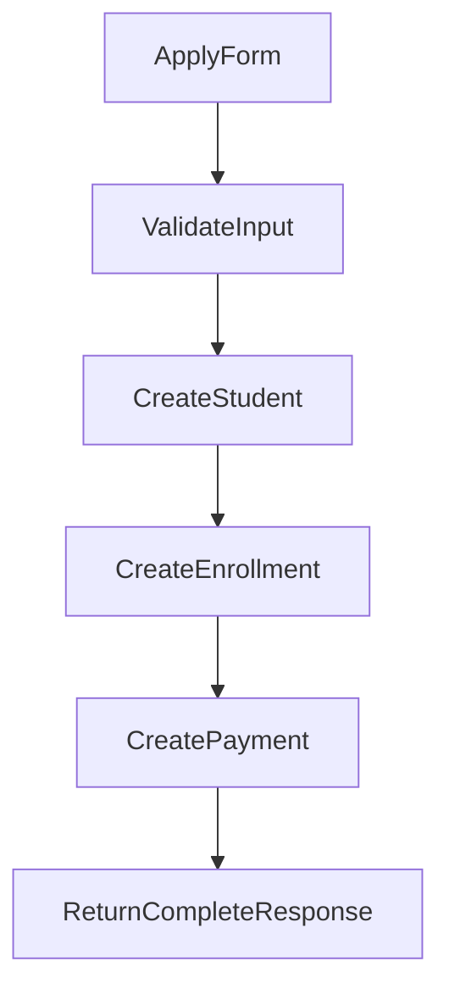

# 申込時データ作成フロー

## 方針
- 申し込みフォーム送信時に `Student` `Enrollment` `Payment` を同一トランザクションで作成する。
- `ReferralSource` は当面固定選択肢を API で返し、保存時は固定 ID を `students.referral_source_id` に設定する。
- `Payment.enrollment_id` が必須のため、`Enrollment` は申し込み時点で先に作成する。

## 初期状態
- `Student.status = PROVISIONAL`
- `Enrollment.status = ENROLLED`
- `Payment.status = UNPAID`
- `Payment.amount = Course.price`

## 想定フロー

## 実装メモ
- 公開フォームでは `courseId` と `referralSourceId` を受け取る。
- `Enrollment.start_date` は申し込み時点では業務ルールに応じて暫定日を設定するか、Phase3で nullable 化を再検討する。
- 入金確認時に `Student.status` を `PRE_HEARING` へ遷移させ、ヒアリングURL発行とメール送付へ接続する。
- 管理画面からの受講生登録も同じサービスを使い、公開フォームとの差分は入力項目と認可だけにする。
